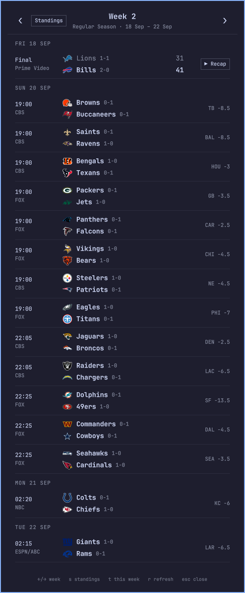
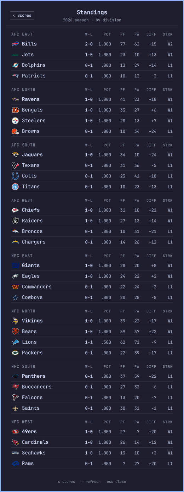

# NFL Scores

[](LICENSE)

NFL Scores is a bar widget for the [Omarchy](https://omarchy.org) shell. The bar shows the current week and the number of games that are live right now. A click on the widget opens a panel with the scores and the schedule of every game in the week, and you can step through every week of the season. The panel also has a standings view, by division. The data comes from ESPN's public scoreboard, which does not need an API key.

| Scores and schedule | Standings |
| :---: | :---: |
|  |  |

## Contents

- [Features](#features)
- [Requirements](#requirements)
- [Installation](#installation)
- [Usage](#usage)
- [IPC](#ipc)
- [Theming](#theming)
- [How it works](#how-it-works)
- [Troubleshooting](#troubleshooting)
- [Disclaimer](#disclaimer)
- [License](#license)

## Features

- The bar shows `🏈 W2`, plus `● 3` in the active color while three games are live
- A panel with every game of the week: kickoff time in your timezone, TV network, team records, the score, and the betting spread before kickoff
- Live games refresh every 30 seconds, and everything else every 5 minutes
- Step through the whole season: the preseason, the regular season and the postseason
- Standings for the 32 teams, by division: record, win percentage, points for and against, difference, and streak
- A **Recap** button on each finished game once the official NFL highlights are on YouTube, which opens the video
- Keyboard control, and an IPC interface for keybinds and scripts
- Follows your Omarchy theme and bar font
- No API key, and no account

## Requirements

- [Omarchy](https://omarchy.org) with the shell plugin system
- `curl`, to fetch the scores
- (Optional) [`yt-dlp`](https://github.com/yt-dlp/yt-dlp) and `python3`, to find the highlights video behind the **Recap** button. Without them the button does not appear, and the rest of the plugin works the same.

## Installation

```bash
omarchy plugin add https://github.com/Onra/omarchy-nfl-scores.git --enable
```

That clones the repository into `~/.config/omarchy/plugins/onra.nfl-scores`, validates the manifest, and enables the widget. To update or remove it later:

```bash
omarchy plugin update onra.nfl-scores
omarchy plugin remove onra.nfl-scores
```

The widget belongs to the `center` section of the bar by default. To place it somewhere else, set its position in the bar layout in `~/.config/omarchy/shell.json`:

```json
{
  "bar": {
    "layout": {
      "right": [
        { "id": "onra.nfl-scores" }
      ]
    }
  }
}
```

> [!IMPORTANT]
> The shell compiles QML when it starts. After you install the plugin, or edit one of its files, run `omarchy restart shell` to see the result.

## Usage

| Action | Result |
|---|---|
| Click on the bar widget | Open or close the panel |
| Middle-click on the bar widget | Refresh the scores now |
| `←` / `→` | Previous or next week (scores view) |
| `↑` / `↓` | Scroll the list |
| `t` | Jump back to the scores of this week |
| `s` | Switch between the scores and the standings |
| `r` | Refresh |
| `Esc` | Close the panel |

The header of the panel has the same controls as buttons: the arrows step through the weeks, a **This week** button appears when you look at another week, and the **Standings** button switches the view. The panel always opens on the scores of the current week.

When the bar is vertical, the widget shows the 🏈 glyph alone.

## IPC

The plugin answers the shell's IPC on the target `onra.nfl-scores`, so a keybind or a script can drive it without the mouse:

```bash
omarchy-shell onra.nfl-scores toggle
```

| Function | Description |
|---|---|
| `open`, `show` | Open the panel |
| `close`, `hide` | Close the panel |
| `toggle` | Open or close the panel |
| `next`, `prev` | Step to the next or the previous week |
| `today` | Show the scores of the current week |
| `scores` | Switch to the scores |
| `standings` | Switch to the standings |
| `refresh` | Fetch now |

For example, this line in `~/.config/hypr/bindings.lua` opens the panel on a key:

```lua
o.bind("SUPER + ALT + N", "NFL scores", "omarchy-shell onra.nfl-scores toggle")
```

## Theming

The panel takes the colors and the font from the shell, so it follows the Omarchy theme that is active, and it changes when you change the theme. The team logos come from ESPN.

## How it works

1. `Fetcher.qml` calls the ESPN scoreboard API with `curl`. The first call asks for the current week, which also gives the calendar of the whole season.
2. `Model.js` turns the JSON of ESPN into the rows that the panel draws: the games, the standings, and the label of the bar.
3. `Panel.qml` owns the fetchers and the refresh timer, so the label of the bar stays current while the panel is closed. When you step to another week, that week is fetched when you look at it, and the weeks that are final stay in memory.
4. For finished games, `recap.py` looks for the official highlights video on the NFL channel of YouTube with `yt-dlp`. It keeps the answers in `~/.cache/onra-nfl-scores/recaps.json`. A video that is found stays in the cache. A game with no video is searched again after 30 minutes, because the NFL posts the highlights some hours after the game ends.

## Troubleshooting

| Symptom | Cause | Fix |
|---|---|---|
| The bar shows `🏈 NFL` and it stays dim | The first fetch failed, or is not finished | Check the network, then middle-click the widget to fetch again |
| The panel does not change after you edit a file | The shell holds QML in its cache | Run `omarchy restart shell` |
| No **Recap** button on a finished game | `yt-dlp` is not installed, or the NFL has not posted the video yet | Install `yt-dlp`. The plugin searches again after 30 minutes |
| The **Recap** button opens nothing | No default application for links | Set a browser as the default with `xdg-settings` |
| The scores are old | A fetch failed, and the panel shows the last data it has | Press `r` in the panel to fetch again |

## Disclaimer

This is an unofficial project. It is not affiliated with, or endorsed by, the NFL or ESPN. The team names and logos are trademarks of their owners. The plugin reads ESPN's public web endpoints, which have no promise of stability, so a change on their side can break the plugin.

## License

[MIT](LICENSE)
